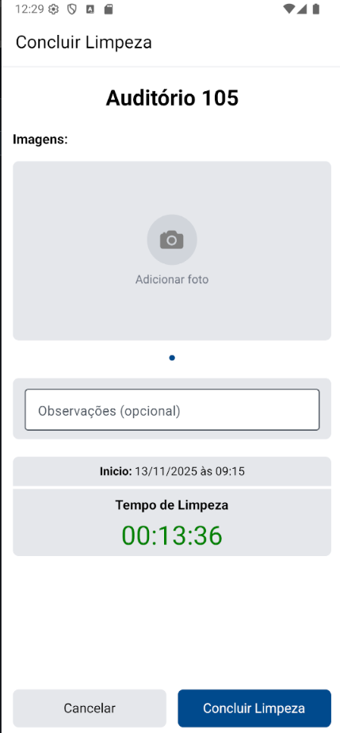

# 📚 Manual de Uso do Aplicativo senacZeladoria

Este manual detalha o passo a passo de como utilizar as funcionalidades do aplicativo senacZeladoria. As instruções estão organizadas por perfis de acesso, que definem as suas permissões no sistema: **Equipe de Zeladoria**, **Usuários Solicitantes de Serviço** e **Administração**.

## 1. Primeiros Passos e Visão Geral (Tela Salas)

A tela **Salas** é a primeira que você vê ao fazer login e é o ponto de partida para todas as suas atividades.

* **1.1 Localizar Sala (Busca/Filtro)**

  * **Permissão:** Todos

  * **Detalhe:** Use a Barra de Pesquisa ou o ícone de Filtro (canto superior direito) para buscar e filtrar as salas.

* **1.2 Acessar Sala (QR Code)**

  * **Permissão:** Todos

  * **Detalhe:** Clique no ícone de QR Code (canto superior direito) para usar a câmera e **acessar diretamente a tela de Detalhes da Sala**.

* **1.3 Ver Notificações**

  * **Permissão:** Zeladoria

  * **Detalhe:** O ícone de Sino (canto superior direito) mostra **notificações** não lidas. Clique para ver suas **notificações** (item 5).

* **1.4 Ver Limpezas em Andamento**

  * **Permissão:** Zeladoria

  * **Detalhe:** O botão **"Limpezas em Andamento"** **só aparece se houver uma limpeza em curso** associada ao seu usuário. Permite retomar tarefas.

* **1.5 Acessar Detalhes (Lista)**

  * **Permissão:** Todos

  * **Detalhe:** Clique no **card da sala** na lista da Tela Salas para ver informações completas (localização, capacidade, instruções, etc.).

* **1.6 Criar Sala**

  * **Permissão:** Administrador

  * **Detalhe:** O botão **"Criar Sala"** (rodapé) só aparece para o Administrador. (Veja item 4.4).

## 2. Fluxo da Equipe de Zeladoria

Seu foco é na execução e comprovação dos serviços de limpeza de forma rastreável.

### A. Realizar e Finalizar uma Limpeza

* **2.1 Iniciar o Serviço**

  * **Permissão:** Zeladoria

  * **Tela/Localização:** Detalhes da Sala / Botão "Iniciar Limpeza"

  * **Detalhe:** O botão **"Iniciar Limpeza"** (verde) só aparece para Zeladoria. O sistema começa a cronometrar o tempo de serviço.

* **2.2 Acessar Conclusão (Retomada)**

  * **Permissão:** Zeladoria

  * **Tela/Localização:** Limpezas em Andamento / Clique no Card

  * **Detalhe:** **Se você interromper a limpeza**, use o botão **"Limpezas em Andamento"** na Tela Salas. Clique no card para **retomar o serviço** e ir para a tela de Conclusão.

* **2.3 Acessar Conclusão (Fluxo Direto)**

  * **Permissão:** Zeladoria

  * **Tela/Localização:** Detalhes da Sala / Botão "Concluir Limpeza"

  * **Detalhe:** Ao iniciar a limpeza, o botão **"Iniciar Limpeza"** é substituído por **"Concluir Limpeza"**. Clique aqui para **acessar a tela de Conclusão** e finalizar o registro.

* **2.4 Comprovar com Fotos**

  * **Permissão:** Zeladoria

  * **Tela/Localização:** Concluir Limpeza / Área "Adicionar foto"

  * **Detalhe:** **OBRIGATÓRIO:** Adicione **pelo menos uma foto** para comprovar a qualidade da limpeza. A tela **Concluir Limpeza** exibe o **Timer** (tempo de serviço) e a data de início.

* **2.5 Adicionar Detalhes**

  * **Permissão:** Zeladoria

  * **Tela/Localização:** Concluir Limpeza / Campo "Observações (opcional)"

  * **Detalhe:** Opcional: Adicione qualquer **Observação** (Ex: "Aviso de lâmpada queimada").

* **2.6 Finalizar o Serviço**

  * **Permissão:** Zeladoria

  * **Tela/Localização:** Concluir Limpeza / Botão "Concluir Limpeza"

  * **Detalhe:** Use o botão **"Concluir Limpeza"** (azul, na parte inferior) após terminar a comprovação. A sala muda para o status **"Limpa"**.

### B. Acompanhar Seus Históricos e Salas Atribuídas

* **2.7 Ver Salas Atribuídas**

  * **Permissão:** Zeladoria/Admin

  * **Tela/Localização:** Tela Perfil / Ícone de Arquivo

  * **Detalhe:** Veja a lista das salas pelas quais você é responsável (Zelador) ou de todas as salas (Admin). **Clique no card de uma sala atribuída para ir para a tela Detalhes da Sala.**

* **2.8 Acessar Meus Registros**

  * **Permissão:** Zeladoria/Admin

  * **Tela/Localização:** Tela Perfil / Ícone de Gráfico

  * **Detalhe:** Veja a lista completa das limpezas que você realizou (Zelador) ou todas as limpezas do sistema (Admin).

* **2.9 Ver Prova Visual**

  * **Permissão:** Zeladoria/Admin

  * **Tela/Localização:** Registros / Clique no Card

  * **Detalhe:** Clique no card do registro para ver as **Fotos de Comprovação** e **Observações** na tela Detalhes de Limpeza.

## 3. Fluxo de Usuários Solicitantes de Serviço (Fiscalização)

Seu papel é acionar a manutenção imediatamente quando notar que uma sala precisa de atenção (não-conformidade, sujeira).

* **3.1 Encontrar a Sala**

  * **Permissão:** Solicitante/Todos

  * **Tela/Localização:** Tela Salas

  * **Detalhe:** Localize a sala suja usando a lista, pesquisa ou QR Code.

* **3.2 Reportar o Problema**

  * **Permissão:** Solicitante

  * **Tela/Localização:** Detalhes da Sala / Botão "Reportar Sujeira"

  * **Detalhe:** O botão **"Reportar Sujeira"** (amarelo) só aparece para usuários do grupo Solicitante na tela Detalhes.

* **3.3 Verificar Ação**

  * **Permissão:** Solicitante/Todos

  * **Tela/Localização:** Tela Salas

  * **Detalhe:** A sala mudará imediatamente para o status **"Suja"**. Uma notificação é enviada para a Equipe de Zeladoria.

## 4. Fluxo de Administração (Gestão, Relatórios e Usuários)

Você tem acesso irrestrito a todas as informações, relatórios e ferramentas de controle do sistema.

### A. Gerenciamento de Usuários

* **4.1 Acessar Painel**

  * **Permissão:** Administrador

  * **Tela/Localização:** Barra de Navegação

  * **Detalhe:** O ícone da tela **Usuários** no rodapé só é visível para o Administrador.

* **4.2 Criar Nova Conta**

  * **Permissão:** Administrador

  * **Tela/Localização:** Usuários / Botão "Criar Usuário" (Rodapé)

  * **Detalhe:** Preencha os dados e defina as permissões (Admin/Comum) e os **Grupos** (Zeladoria/Solicitante).

* **4.3 Buscar e Filtrar**

  * **Permissão:** Administrador

  * **Tela/Localização:** Usuários / Barra de pesquisa e Filtros

  * **Detalhe:** Pesquise por **Username** ou use o **ícone de Filtro** para listar por **Grupos** e **Status** de permissão.

### B. Gestão de Salas e QR Codes

* **4.4 Criar Nova Sala**

  * **Permissão:** Administrador

  * **Tela/Localização:** Tela Salas / Botão "Criar Sala" (Rodapé)

  * **Detalhe:** Este botão só aparece para o Administrador. Clique para abrir o formulário.

* **4.5 Editar/Excluir Sala**

  * **Permissão:** Administrador

  * **Tela/Localização:** Detalhes da Sala / Ícones de Lixo/Lápis

  * **Detalhe:** Os ícones de **Lixeira** (vermelho) e **Lápis** (azul) só aparecem para o Administrador.

* **4.6 Gerar QR Codes**

  * **Permissão:** Administrador

  * **Tela/Localização:** Estatísticas e Relatórios / Ícone de Documento

  * **Detalhe:** Clique neste ícone para gerar o **PDF dos QR Codes** das salas para impressão.

### C. Análise de Desempenho e Rastreabilidade (Relatórios)

* **4.7 Ver Status Geral**

  * **Permissão:** Administrador

  * **Tela/Localização:** Estatísticas e Relatórios

  * **Detalhe:** O ícone da tela **Estatísticas** na barra de navegação só é visível para o Administrador.

* **4.8 Monitorar em Tempo Real**

  * **Permissão:** Administrador

  * **Tela/Localização:** Estatísticas / Botão "Ver limpezas em andamento"

  * **Detalhe:** Acompanhe o **tempo de duração** das limpezas ativas.

* **4.9 Auditar Histórico (Registros)**

  * **Permissão:** Administrador

  * **Tela/Localização:** Registros (Acesso via Barra de Navegação)

  * **Detalhe:** Use o ícone de **"Registros"** para buscar por **Sala** ou **Zelador** em todo o histórico.

* **4.10 Analisar Desempenho**

  * **Permissão:** Administrador

  * **Tela/Localização:** Estatísticas / Botão "Ver limpezas de zeladores"

  * **Detalhe:** Veja as métricas de velocidade e histórico individual de cada membro da equipe de limpeza.

* **4.11 Detalhes da Auditoria**

  * **Permissão:** Administrador

  * **Tela/Localização:** Registros / Clique no Card

  * **Detalhe:** Na tela **Registros**, clique no card para ver as **Fotos de Comprovação** e o tempo exato de serviço.

## 5. Gerenciamento de Notificações

A central de **Notificações** é onde você recebe comunicações importantes sobre o sistema e a manutenção.

* **5.1 Acessar Notificações**

  * **Permissão:** Zeladoria

  * **Tela/Localização:** Tela Salas / Ícone de Sino

  * **Detalhe:** Clique no ícone de sino (no canto superior direito) para abrir a lista de **notificações**.

* **5.2 Ver e Agir**

  * **Permissão:** Zeladoria

  * **Tela/Localização:** Clique no Card da Notificação

  * **Detalhe:** Ao clicar em uma **notificação**, o app te leva diretamente para a tela **Detalhes da Sala** para uma ação imediata.

* **5.3 Limpar Notificações**

  * **Permissão:** Zeladoria

  * **Tela/Localização:** Botão "Marcar notificações como lidas"

  * **Detalhe:** Use este botão no topo da tela para limpar suas **notificações** pendentes.

## 6. Configurações Pessoais (Todos os Usuários)

A tela de **Perfil** serve para gerenciar dados de acesso e segurança, e não o fluxo de trabalho principal.

* **6.1 Acessar o Perfil**

  * **Permissão:** Todos

  * **Detalhe:** Clique no **ícone de perfil** na **barra de navegação inferior**.

* **6.2 Gerenciar Foto**

  * **Permissão:** Todos

  * **Detalhe:** Clique no seu **avatar** para adicionar uma foto. Use o botão **"X"** para deletá-la.

* **6.3 Mudar Senha**

  * **Permissão:** Todos

  * **Detalhe:** Clique no botão **"Alterar Senha"** para criar uma nova senha de acesso.

* **6.4 Sair da Conta**

  * **Permissão:** Todos

  * **Detalhe:** Clique no botão **"Sair"** (vermelho, na parte inferior) para encerrar sua sessão.
