# 🧹 Projeto senacZeladoria

Este projeto facilita a gestão e fiscalização da manutenção de espaços físicos (salas, laboratórios, escritórios) do Senac mossoró. O sistema substitui fluxos de trabalho manuais por um processo eficiente e em tempo real, garantindo rastreabilidade total e a excelência na qualidade dos serviços de limpeza.

### **Funcionalidade Geral**

O sistema conecta diferentes perfis de usuário em um ciclo de manutenção contínuo:

* **Equipe de Zeladoria:** Focada na execução, utiliza o aplicativo como um diário de bordo digital. O processo inicia com "Iniciar Limpeza" e é finalizado com o upload obrigatório de fotos como comprovação do serviço. Ao concluir, a sala recebe o status "Limpa", cuja validade é monitorada automaticamente (por horas definidas para a sala) ou é interrompida por um reporte de sujeira.

* **Usuários Solicitantes de Serviço:** Atuam como fiscais e facilitadores. Em caso de não conformidade ou sujeira (desorganização, incidentes), podem "Marcar como Suja" instantaneamente. Essa ação prioriza o serviço, enviando uma notificação imediata à manutenção e alterando o status da sala.

* **Administração** Detém o controle e a visibilidade totais. Gerencia usuários, cadastra e edita salas, e acessa o histórico completo e filtrável de todas as operações de limpeza (responsável, data/hora e fotos). Administradores também podem acumular os perfis de Zeladoria e Solicitante, podendo executar todas as funções.

### **Benefícios Chave**

* Rastreabilidade Total: Cada evento crucial (início e conclusão) é carimbado com data, hora e associado ao usuário responsável, criando um log inalterável da manutenção.

* Garantia de Qualidade: A exigência de comprovação visual (fotos) na conclusão do serviço assegura a verificação do padrão de limpeza.

* Comunicação Imediata: O sistema utiliza notificações in-app para alertar a equipe de manutenção sobre reportes de sujeira em tempo real ou limpezas expiradas, acelerando o tempo de resposta.

* Segurança e Controle de Acesso: O acesso é estritamente baseado em perfis, garantindo que as permissões de execução de tarefas sejam limitadas e pertinentes à função de cada colaborador.

## Telas do app

* **Salas:**
  * **Visibilidade Adaptável:** A listagem exibe salas ativas (para a Zeladoria/Solicitantes) ou todas as salas (para a Administração), com cards que mostram o **nome, imagem e status** atual da sala (Limpa, Suja, Pendente).
  * **Ferramentas de Navegação:**
      * **Filtros Avançados:** Permitem a busca rápida e precisa por salas.
      * **Leitor de QR Code:** Acesso direto para identificar salas no campo.
      * **Acesso a Notificações:** Link rápido para a central de alertas do usuário.
  * **Ações Dinâmicas:** Os cards de sala apresentam botões contextuais que dependem do status da sala e do perfil do usuário, incluindo:
      * **Início de Limpeza** (Zeladoria).
      * **Reportar Sujeira** (Solicitantes).
      * **Edição e Deleção** (Administração).
  * **Botões de Status:** Inclui os botões **"Limpezas em Andamento"** (se houver tarefas pendentes para o Zelador) e **"Criar Sala"** (para o Administrador).

* **Detalhes da Sala**

  * **Dados Essenciais:** Exibe o **Nome**, **Status**, **Imagem**, **Capacidade**, **Localização**, **Descrição** e se a sala está **Ativa ou Inativa**.
  * **Informações de Manutenção:** Detalha as **Instruções de Limpeza** (se houver), a **Última Limpeza** registrada, sua **Validade** (em horas) e a lista de **Responsáveis** designados para a limpeza da sala.
  * **Ações Contextuais:** Botões de função são exibidos condicionalmente, conforme o perfil do usuário:
      * **Reportar Sujeira** (Disponível se não estiver Suja).
      * **Iniciar Limpeza** (Zeladoria).
      * **Editar** e **Excluir** (Administração, se a sala for passível de exclusão).
  * **Acesso ao Histórico:** Um botão dedicado leva à **Tela de Registros da Sala** (Histórico de Limpezas), sendo visível apenas para usuários com perfil **Administrador ou Zeladoria**.

* **Concluir Limpeza (Acesso zelador)**

  * **Comprovação Obrigatória:** Permite o **upload de fotos**, sendo **obrigatório** o envio de pelo menos uma imagem para comprovar a realização do serviço e a qualidade da limpeza.
  * **Registro de Detalhes:** O zelador pode adicionar **Observações (opcional)** sobre o serviço realizado ou quaisquer incidentes.
  * **Monitoramento de Tempo:** Exibe o horário de **Início da Limpeza** e possui um **timer funcional** que calcula o **Tempo de Limpeza** em tempo real, garantindo a precisão da métrica de velocidade.
 
* **Registros (Acesso admin ou zelador)**

  * **Ferramentas de Busca:** Inclui um campo de pesquisa para filtrar rapidamente os registros por **nome da sala** ou **nome de usuário do zelador**.
  * **Visão Analítica:** Exibe um gráfico que resume a **velocidade das limpezas** concluídas (Rápida, Média, Lenta) em todo o sistema.
  * **Card de Registro:** Cada card resume uma sessão de limpeza, apresentando:
      * **Identificação:** Nome da Sala e Zelador responsável.
      * **Tempo:** Horário de **Início** e **Fim** do registro, e o **Tempo de Limpeza** total, que é codificado por cores (verde para rápido, vermelho para lento).
      * **Evidências:** Indicadores visuais de **número de imagens** anexadas e se há **Observações** do zelador.
  * **Drill-Down:** Ao clicar no card, o usuário é levado à **Detalhes da Limpeza**, que mostra detalhes ainda mais aprofundados sobre aquele registro específico.

* **Detalhes de Limpeza (Acesso admin ou zelador)**

  * **Evidências Visuais:** Exibe todas as **Imagens** anexadas pelo zelador durante o serviço (em formato de galeria, se houver mais de uma foto).
  * **Detalhes do Serviço:** Consolida a informação crucial sobre a execução:
      * **Responsável:** O nome do zelador que realizou o serviço.
      * **Observações:** O texto inserido pelo zelador na conclusão da limpeza.
  * **Metadados de Tempo:** Mostra com precisão o horário de **Início** e **Fim** do registro, e o **Tempo de Limpeza** total, com a codificação de cor para indicar a velocidade de execução.

* **Estatísticas e Relatórios (Acesso Admin)**

  * **Ferramentas de Cabeçalho:** Contém dois botões utilitários cruciais para a gestão: um que direciona para a **Tela de Registros** (Histórico de Limpezas completo) e outro que redireciona para o **PDF dos QR Codes das Salas** para download e impressão.
  * **Visão Geral (Gráficos):**
      * **Status de Limpeza:** Gráfico de barras que exibe a proporção de salas em cada status: **Limpa**, **Limpeza Pendente**, **Suja** e **Em Limpeza**.
      * **Status de Salas:** Gráfico que mostra a contagem de salas **Ativas** vs. **Inativas**.
      * **Velocidade de Limpeza:** Gráfico que analisa o histórico de limpezas concluídas, classificando a velocidade de execução (Rápida, Média, Lenta) dos zeladores.
  
  * **Relatórios Detalhados (Drill-Down):**
      * **Limpezas em Andamento:** Lista todas as limpezas ativas, exibindo **timer de duração**, **usuário responsável** e **sala**, permitindo ao administrador o monitoramento em tempo real.
      * **Limpezas de Zeladores:** Lista todos os zeladores. O card exibe a **contagem total de limpezas** e o gráfico de **velocidade individual** (Rápida/Média/Lenta). Clicar no card leva a uma tela com o registro de cada limpeza realizada por aquele zelador.
      * **Limpezas de Salas:** Lista todas as salas. O card exibe **imagem**, **nome**, **contagem total de limpezas** e status **Ativa/Inativa**. Clicar no card leva a uma tela com o registro de cada limpeza realizada naquela sala.

* **Usuários (Acesso Admin)**

  * **Ferramentas de Pesquisa e Filtragem:**
      * **Pesquisa:** Permite buscar usuários por **username**.
      * **Filtros Avançados:** Filtra a listagem por **Status do Usuário** (Admin ou Usuário Padrão) e por **Grupos** específicos (Solicitante de Serviços, Zeladoria ou Sem Grupos).
  * **Cards de Usuários:** Exibe informações essenciais e permissões de cada conta:
      * **Identificação:** Imagem (se houver), **Username**, **Email** e **Nome Completo**.
      * **Permissões:** Tags visuais indicam se o usuário é **Admin** ou **Usuário Padrão**, e quais **Grupos** (Zeladoria, Solicitante de Serviços) ele pertence.
  * **Criação de Usuário (Formulário):** O botão **"Criar Usuário"** abre um formulário modal que permite ao administrador cadastrar novas contas, exigindo:
      * **Dados de Acesso:** Nome de Usuário, Senha e Confirmação de Senha.
      * **Dados Pessoais:** Nome Completo e Email.
      * **Definição de Perfil:** Um *multiselect* para atribuição opcional aos **Grupos** de trabalho e um *picker* para definir o status de **Admin** ou **Usuário Comum**.

* **Notificações:**
  * **Gestão de Alertas:** O usuário pode **marcar uma notificação específica como lida** ou **marcar todas as pendentes como lidas** de uma só vez, para gerenciar o volume de alertas.
  * **Cards Informativos:** Cada card de notificação exibe o **horário do evento** e informações essenciais da sala relacionada. O status de **lida ou não lida** é indicado visualmente.
  * **Ação Rápida:** Ao clicar em um card, o usuário é direcionado imediatamente à tela **Detalhes sala**, onde a sala em questão é destacada, permitindo que a **Equipe de Zeladoria inicie a limpeza** ou que o administrador verifique o status de manutenção.

* **Perfil**

  * **Dados de Identificação:** Exibe o **Username**, **Email**, **Nome Completo**, **Nível de Permissão** (Admin/Padrão) e os **Grupos do Usuário** (Zeladoria, Solicitante de Serviços).
  * **Gestão da Foto de Perfil:** O usuário pode **adicionar** uma foto de perfil (galeria ou câmera) ao clicar no avatar ou **deletá-la** usando o botão "X".
  * **Ferramentas de Cabeçalho (Contextuais):**
      * **Salas Atribuídas:** Botão que exibe uma lista das salas pelas quais o zelador é responsável, permitindo navegação rápida para a sala.
      * **Meus Registros:** Botão que redireciona o usuário para a lista de todos os seus registros de limpeza individuais (visível apenas para Zeladores).
  * **Ações de Segurança:**
      * **Alterar Senha:** Permite que o usuário modifique sua senha atual.
      * **Sair:** Desconecta o usuário do aplicativo, encerrando a sessão.

# 📚 Manual de Uso do Aplicativo senacZeladoria

Este manual detalha o passo a passo de como utilizar as funcionalidades do aplicativo senacZeladoria. As instruções estão organizadas por perfis de acesso, que definem as suas permissões no sistema: **Equipe de Zeladoria**, **Usuários Solicitantes de Serviço** e **Administração**.

## 1. Primeiros Passos e Visão Geral (Tela Salas)

A tela **Salas** é a primeira que você vê ao fazer login e é o ponto de partida para todas as suas atividades.

* **1.1 Localizar Sala (Busca/Filtro)**

  * **Permissão:** Todos

  * **Detalhe:** Use a Barra de Pesquisa ou o ícone de Filtro (canto superior direito) para buscar e filtrar as salas.

* **1.2 Acessar Sala (QR Code)**

  * **Permissão:** Todos

  * **Detalhe:** Clique no ícone de QR Code (canto superior direito) para usar a câmera e **acessar diretamente a tela de Detalhes da Sala**.

* **1.3 Ver Notificações**

  * **Permissão:** Zeladoria

  * **Detalhe:** O ícone de Sino (canto superior direito) mostra **notificações** não lidas. Clique para ver suas **notificações** (item 5).

* **1.4 Ver Limpezas em Andamento**

  * **Permissão:** Zeladoria

  * **Detalhe:** O botão **"Limpezas em Andamento"** **só aparece se houver uma limpeza em curso** associada ao seu usuário. Permite retomar tarefas.

* **1.5 Acessar Detalhes (Lista)**

  * **Permissão:** Todos

  * **Detalhe:** Clique no **card da sala** na lista da Tela Salas para ver informações completas (localização, capacidade, instruções, etc.).

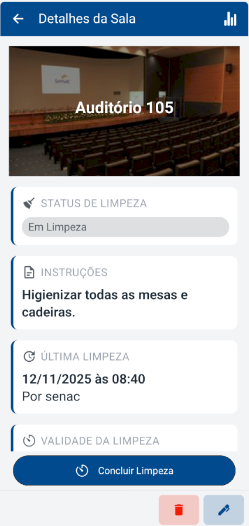

* **1.6 Criar Sala**

  * **Permissão:** Administrador

  * **Detalhe:** O botão **"Criar Sala"** (rodapé) só aparece para o Administrador. (Veja item 4.4).

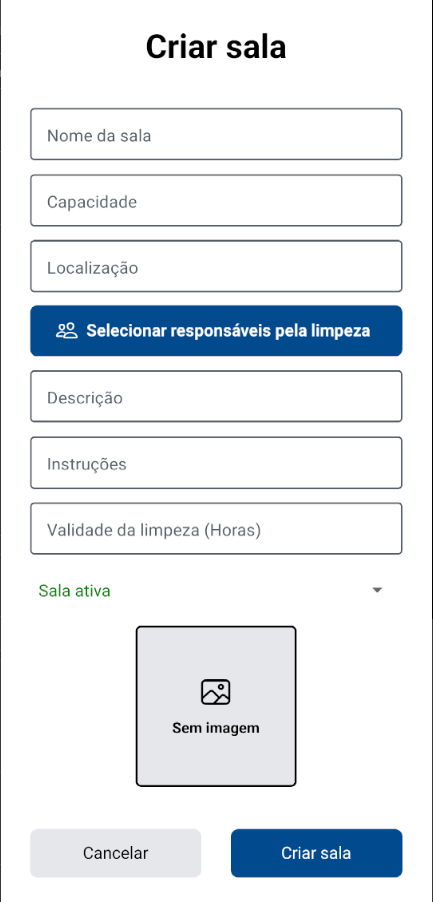

## 2. Fluxo da Equipe de Zeladoria

Seu foco é na execução e comprovação dos serviços de limpeza de forma rastreável.

### A. Realizar e Finalizar uma Limpeza

* **2.1 Iniciar o Serviço**

  * **Permissão:** Zeladoria

  * **Tela/Localização:** Detalhes da Sala / Botão "Iniciar Limpeza"

  * **Detalhe:** O botão **"Iniciar Limpeza"** (verde) só aparece para Zeladoria. O sistema começa a cronometrar o tempo de serviço.

* **2.2 Acessar Conclusão (Retomada)**

  * **Permissão:** Zeladoria

  * **Tela/Localização:** Limpezas em Andamento / Clique no Card

  * **Detalhe:** **Se você interromper a limpeza**, use o botão **"Limpezas em Andamento"** na Tela Salas. Clique no card para **retomar o serviço** e ir para a tela de Conclusão.

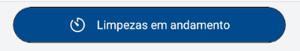

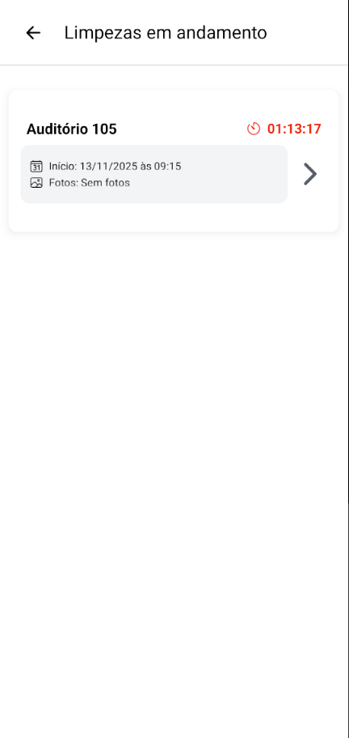

* **2.3 Acessar Conclusão (Fluxo Direto)**

  * **Permissão:** Zeladoria

  * **Tela/Localização:** Detalhes da Sala / Botão "Concluir Limpeza"

  * **Detalhe:** Ao iniciar a limpeza, o botão **"Iniciar Limpeza"** é substituído por **"Concluir Limpeza"**. Clique aqui para **acessar a tela de Conclusão** e finalizar o registro.

* **2.4 Comprovar com Fotos**

  * **Permissão:** Zeladoria

  * **Tela/Localização:** Concluir Limpeza / Área "Adicionar foto"

  * **Detalhe:** **OBRIGATÓRIO:** Adicione **pelo menos uma foto** para comprovar a qualidade da limpeza. A tela **Concluir Limpeza** exibe o **Timer** (tempo de serviço) e a data de início.

* **2.5 Adicionar Detalhes**

  * **Permissão:** Zeladoria

  * **Tela/Localização:** Concluir Limpeza / Campo "Observações (opcional)"

  * **Detalhe:** Opcional: Adicione qualquer **Observação** (Ex: "Aviso de lâmpada queimada").

* **2.6 Finalizar o Serviço**

  * **Permissão:** Zeladoria

  * **Tela/Localização:** Concluir Limpeza / Botão "Concluir Limpeza"

  * **Detalhe:** Use o botão **"Concluir Limpeza"** (azul, na parte inferior) após terminar a comprovação. A sala muda para o status **"Limpa"**.

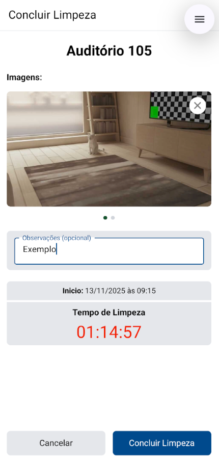

### B. Acompanhar Seus Históricos e Salas Atribuídas

* **2.7 Ver Salas Atribuídas**

  * **Permissão:** Zeladoria/Admin

  * **Tela/Localização:** Tela Perfil / Ícone de Arquivo

  * **Detalhe:** Veja a lista das salas pelas quais você é responsável (Zelador) ou de todas as salas (Admin). **Clique no card de uma sala atribuída para ir para a tela Detalhes da Sala.**

* **2.8 Acessar Meus Registros**

  * **Permissão:** Zeladoria/Admin

  * **Tela/Localização:** Tela Perfil / Ícone de Gráfico

  * **Detalhe:** Veja a lista completa das limpezas que você realizou (Zelador) ou todas as limpezas do sistema (Admin).

* **2.9 Ver Prova Visual**

  * **Permissão:** Zeladoria/Admin

  * **Tela/Localização:** Registros / Clique no Card

  * **Detalhe:** Clique no card do registro para ver as **Fotos de Comprovação** e **Observações** na tela Detalhes de Limpeza.

## 3. Fluxo de Usuários Solicitantes de Serviço (Fiscalização)

Seu papel é acionar a manutenção imediatamente quando notar que uma sala precisa de atenção (não-conformidade, sujeira).

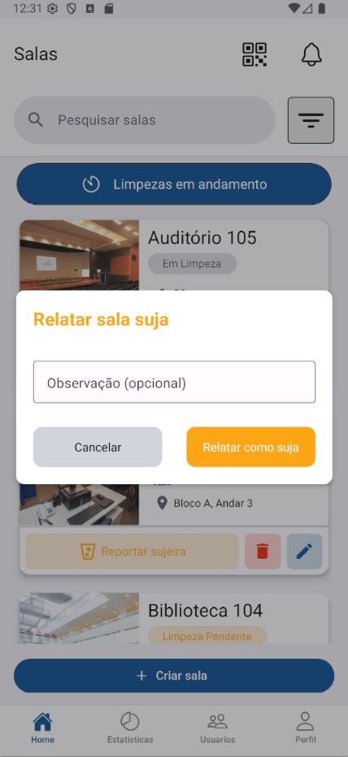

* **3.1 Encontrar a Sala**

  * **Permissão:** Solicitante/Todos

  * **Tela/Localização:** Tela Salas

  * **Detalhe:** Localize a sala suja usando a lista, pesquisa ou QR Code.

* **3.2 Reportar o Problema**

  * **Permissão:** Solicitante

  * **Tela/Localização:** Detalhes da Sala / Botão "Reportar Sujeira"

  * **Detalhe:** O botão **"Reportar Sujeira"** (amarelo) só aparece para usuários do grupo Solicitante na tela Detalhes.

* **3.3 Verificar Ação**

  * **Permissão:** Solicitante/Todos

  * **Tela/Localização:** Tela Salas

  * **Detalhe:** A sala mudará imediatamente para o status **"Suja"**. Uma notificação é enviada para a Equipe de Zeladoria.

## 4. Fluxo de Administração (Gestão, Relatórios e Usuários)

Você tem acesso irrestrito a todas as informações, relatórios e ferramentas de controle do sistema.

### A. Gerenciamento de Usuários

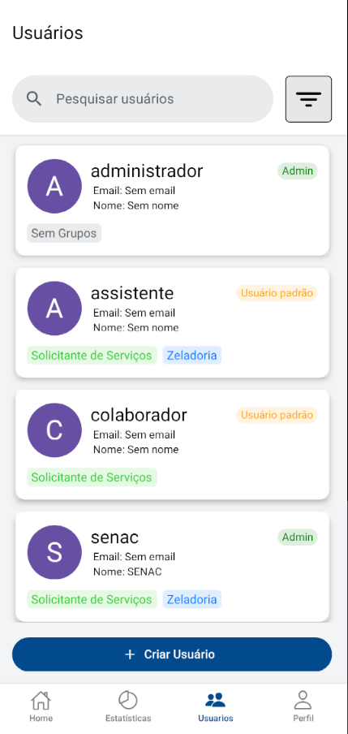

* **4.1 Acessar Painel**

  * **Permissão:** Administrador

  * **Tela/Localização:** Barra de Navegação

  * **Detalhe:** O ícone da tela **Usuários** no rodapé só é visível para o Administrador.

* **4.2 Criar Nova Conta**

  * **Permissão:** Administrador

  * **Tela/Localização:** Usuários / Botão "Criar Usuário" (Rodapé)

  * **Detalhe:** Preencha os dados e defina as permissões (Admin/Comum) e os **Grupos** (Zeladoria/Solicitante).

* **4.3 Buscar e Filtrar**

  * **Permissão:** Administrador

  * **Tela/Localização:** Usuários / Barra de pesquisa e Filtros

  * **Detalhe:** Pesquise por **Username** ou use o **ícone de Filtro** para listar por **Grupos** e **Status** de permissão.

### B. Gestão de Salas e QR Codes

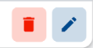

* **4.4 Criar Nova Sala**

  * **Permissão:** Administrador

  * **Tela/Localização:** Tela Salas / Botão "Criar Sala" (Rodapé)

  * **Detalhe:** Este botão só aparece para o Administrador. Clique para abrir o formulário.

* **4.5 Editar/Excluir Sala**

  * **Permissão:** Administrador

  * **Tela/Localização:** Detalhes da Sala / Ícones de Lixo/Lápis

  * **Detalhe:** Os ícones de **Lixeira** (vermelho) e **Lápis** (azul) só aparecem para o Administrador.

* **4.6 Gerar QR Codes**

  * **Permissão:** Administrador

  * **Tela/Localização:** Estatísticas e Relatórios / Ícone de Documento

  * **Detalhe:** Clique neste ícone para gerar o **PDF dos QR Codes** das salas para impressão.

### C. Análise de Desempenho e Rastreabilidade (Relatórios)

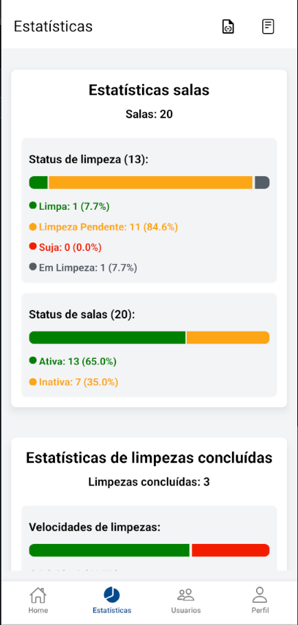
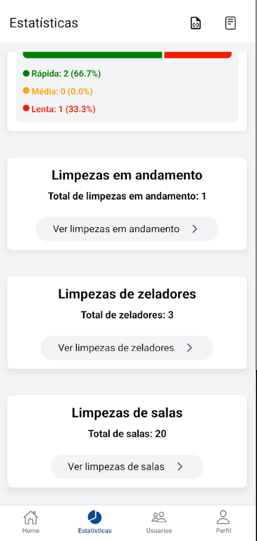

* **4.7 Ver Status Geral**

  * **Permissão:** Administrador

  * **Tela/Localização:** Estatísticas e Relatórios

  * **Detalhe:** O ícone da tela **Estatísticas** na barra de navegação só é visível para o Administrador.

* **4.8 Monitorar em Tempo Real**

  * **Permissão:** Administrador

  * **Tela/Localização:** Estatísticas / Botão "Ver limpezas em andamento"

  * **Detalhe:** Acompanhe o **tempo de duração** das limpezas ativas.

* **4.9 Auditar Histórico (Registros)**

  * **Permissão:** Administrador

  * **Tela/Localização:** Registros (Acesso via Barra de Navegação)

  * **Detalhe:** Use o ícone de **"Registros"** para buscar por **Sala** ou **Zelador** em todo o histórico.

* **4.10 Analisar Desempenho**

  * **Permissão:** Administrador

  * **Tela/Localização:** Estatísticas / Botão "Ver limpezas de zeladores"

  * **Detalhe:** Veja as métricas de velocidade e histórico individual de cada membro da equipe de limpeza.

* **4.11 Detalhes da Auditoria**

  * **Permissão:** Administrador

  * **Tela/Localização:** Registros / Clique no Card

  * **Detalhe:** Na tela **Registros**, clique no card para ver as **Fotos de Comprovação** e o tempo exato de serviço.

## 5. Gerenciamento de Notificações

A central de **Notificações** é onde você recebe comunicações importantes sobre o sistema e a manutenção.

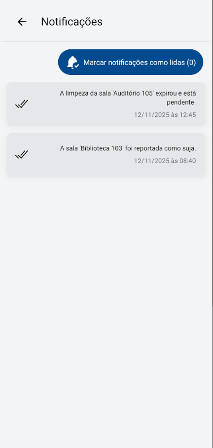

* **5.1 Acessar Notificações**

  * **Permissão:** Zeladoria

  * **Tela/Localização:** Tela Salas / Ícone de Sino

  * **Detalhe:** Clique no ícone de sino (no canto superior direito) para abrir a lista de **notificações**.

* **5.2 Ver e Agir**

  * **Permissão:** Zeladoria

  * **Tela/Localização:** Clique no Card da Notificação

  * **Detalhe:** Ao clicar em uma **notificação**, o app te leva diretamente para a tela **Detalhes da Sala** para uma ação imediata.

* **5.3 Limpar Notificações**

  * **Permissão:** Zeladoria

  * **Tela/Localização:** Botão "Marcar notificações como lidas"

  * **Detalhe:** Use este botão no topo da tela para limpar suas **notificações** pendentes.

## 6. Configurações Pessoais (Todos os Usuários)

A tela de **Perfil** serve para gerenciar dados de acesso e segurança, e não o fluxo de trabalho principal.

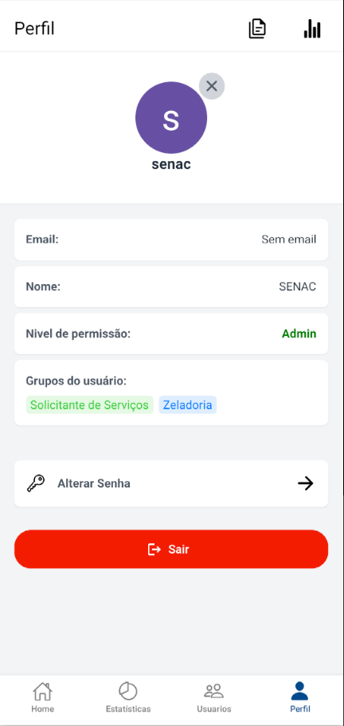

* **6.1 Acessar o Perfil**

  * **Permissão:** Todos

  * **Detalhe:** Clique no **ícone de perfil** na **barra de navegação inferior**.

* **6.2 Gerenciar Foto**

  * **Permissão:** Todos

  * **Detalhe:** Clique no seu **avatar** para adicionar uma foto. Use o botão **"X"** para deletá-la.

* **6.3 Mudar Senha**

  * **Permissão:** Todos

  * **Detalhe:** Clique no botão **"Alterar Senha"** para criar uma nova senha de acesso.

* **6.4 Sair da Conta**

  * **Permissão:** Todos

  * **Detalhe:** Clique no botão **"Sair"** (vermelho, na parte inferior) para encerrar sua sessão.

